# CS885_Waterloo_RL Assignment 2
# Part I

## 1. TestRL2Maze  
> comparing model-based RL and Q-Learning RL(q table w/o neuron network)

(a) 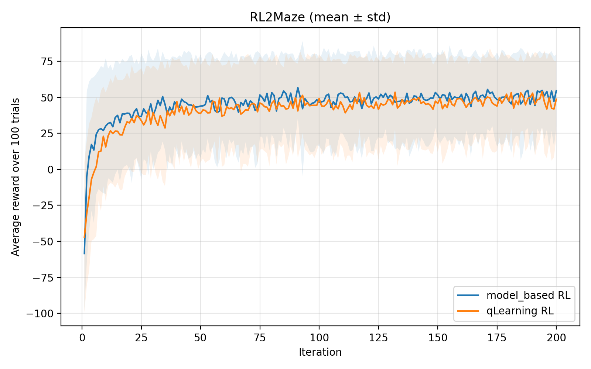  
(b) 實驗結果顯示 model-based RL 在此問題中些微勝過  
* Learning，model-based RL 是基於目前對環境模型的統計數據來跑 value iteration，能基於歷史統計對未來的所有路徑可能做規劃，在環境模型完全準確時就能正確地計算出最佳策略，換句話說，model-based RL 的結果好壞完全取決於對真實環境的估計正確程度
* Q-Learning RL 的作法是基於對每一步經驗的TD error 來更新Q table，每次更新只會更新到當前的state-action pair，更新速度慢，且因為使用單次抽樣導致的 high variance 與 TD 的 high variance 特性，學習速度較慢，此外 Q table + TD 的更新特性也使得本次更新的資料只有在下次實際經過該狀態時才有被利用到的機會，再次減慢了學習的速度。
* 在前幾個episode 中，model-based RL 利用少數 episode 經驗就能統計出一個大致正確的環境模型，使得前期表現比 Q-Learning RL 好，而在中後期Q-Learning 也取得了足夠的學習次數與樣本，最終結果趨於一致。  

## 2. TestBandit
> comparing UCB, epsilon-greedy, Thompson sampling
 
(a) 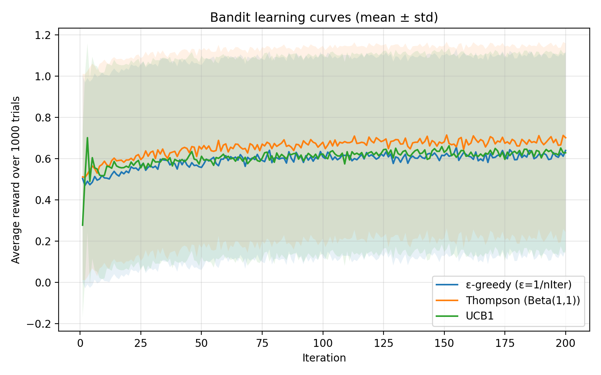  
(b) 
* 實驗表現上，THompson sampling > UCB >= epsilon-greedy，實驗結果符合預期，Thompson sampling 有最好的表現且平滑穩定; UCB 初期的震盪源自於需要先將所有可能固定探索k次所導致的(實驗中k=1)，後續也能快速收斂，具有理論上的收斂上界; epsilon-greedy 只會盲目 uniform 的執行探索，表現最差。

# Part II  
## 1. REINFORCE on Cartpole
> comparing Reinforce、Reinforce with Baseline、PPO on cartpole

(a)  
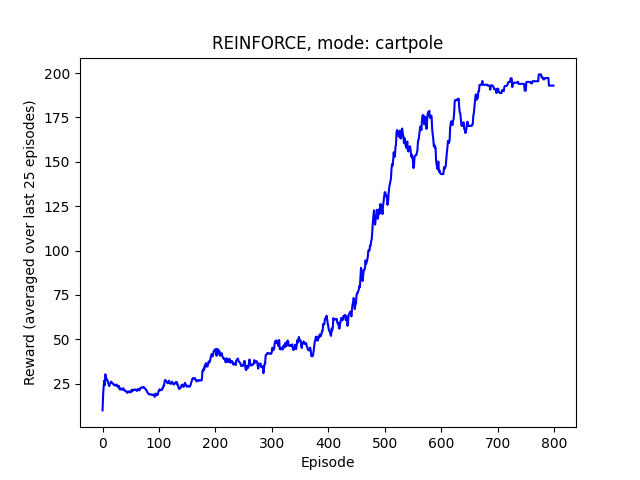  
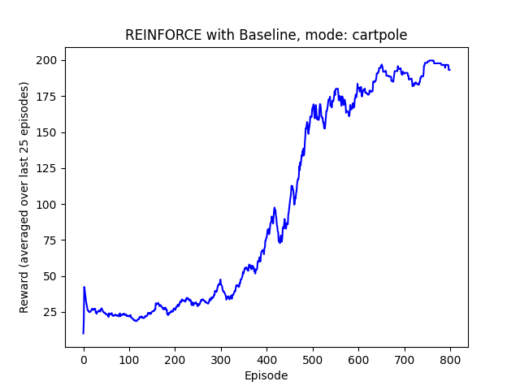  
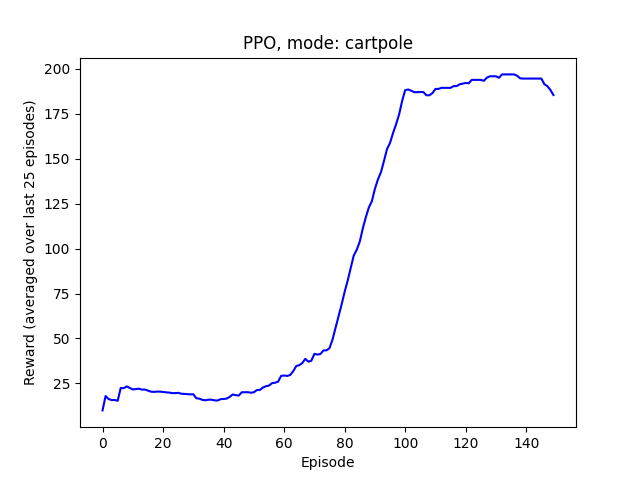  

(b)   
* 在 Cartpole 環境中，Reinforce、Reinforce with Baseline、PPO 三者在訓練後都能接近 return 200 的最佳表現(in episode 800, 800, 150)，其中訓練過程中的平滑程度 PPO > Reinforce with Baseline > Reinforce。  
* 比較 w/o 與 w/ baseline：  
w/ baseline 在訓練中，將原有的學習目標從 return 換成了 advantage，這降低了學習目標的規模，且讓學習的梯度方向從原有 return 的大多同號，只能從大小去學習，變成了 有相對正負方向的 advantage，讓 w/ baseline 方法有更小的方差、訓練表現更平滑。  
* 比較 w/ baseline Reinforce 與 PPO：  
PPO 與 REINFORCE with baseline 都是利用 advantage 作為學習方向，但 PPO 在更新穩定性與資料利用率上表現更好。  不同於 Reinforce with Baseline 只會使用單筆 trajectory 更新一次，PPO 會對同一筆 trajectory 進行多次的更新，方法是使用 Importance Sampling 讓多次更新後的新策略可以使用舊資料繼續訓練，並配合 policy clipping  來限制 policy 更新幅度，使學習更穩定。  

(c)  
> change POLICY_TRAIN_ITERS from 1 to 10 in REINFORCE with baseline

I.  

  
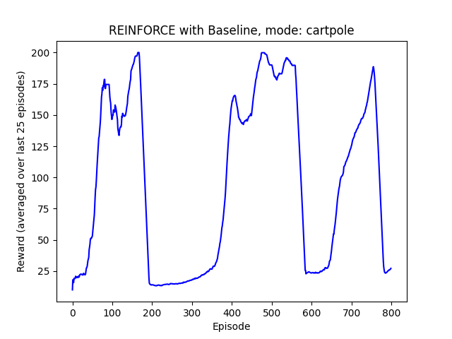  

II.  
* 將 Reinforce with Baseline 重複訓練在150step 內看起來可以得到相似於 PPO 多次更新快速學到策略的趨勢，但是由於沒有使用 Importance sampling 與 policy clipping 使學習極為不穩定，震盪幅度極大，不斷地將所有的策略遺忘再重新學起來，而這明顯不是一個理想的學習方法。

## 2. REINFORCE on Mountain-Car
> comparing Reinforce、Reinforce with Baseline、PPO on Mountain-Car

(a)  
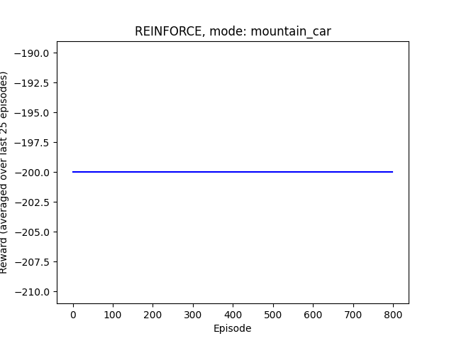  
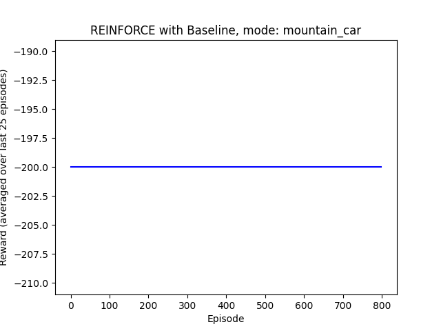  
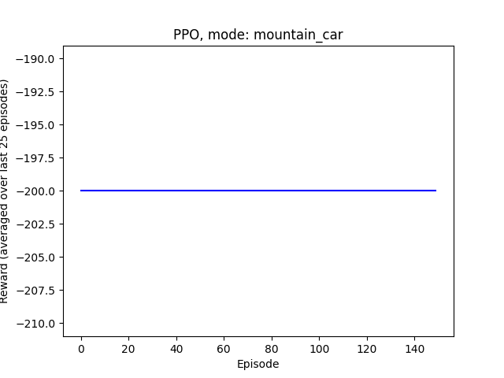  

(b)  
* 所有的演算法在此環境中都沒有學習到任何有用的策略
* 這是源於環境中 sparse reward 的特性，在此環境中，agent 的目標是要把車開到山頂，在此期間的每個step，reward 皆是-1，越快地達成目標會讓return 越大，但是terminal state 本身一開始是難以到達的，因為agent 不管是否朝著正確的方向前進，reward 都不會有變化，使得 agent 想到抵達 terminal state 僅能依靠渺小的隨機探索機率來到達，而糟糕的探索策略使得本實驗的 agent 沒有幾乎機會探索到 terminal state，最終使三種方法都沒有學習到正確的策略

## 3. REINFORCE in Mountain-Car-Mod
> comparing Reinforce、Reinforce with Baseline、PPO on Mountain-Car-Mod

(a)  
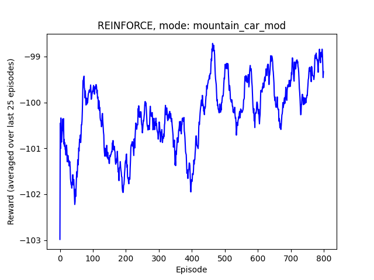  
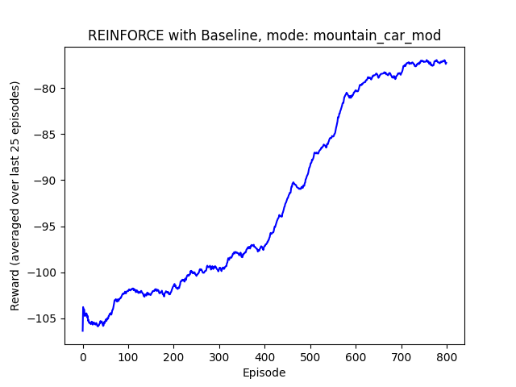  
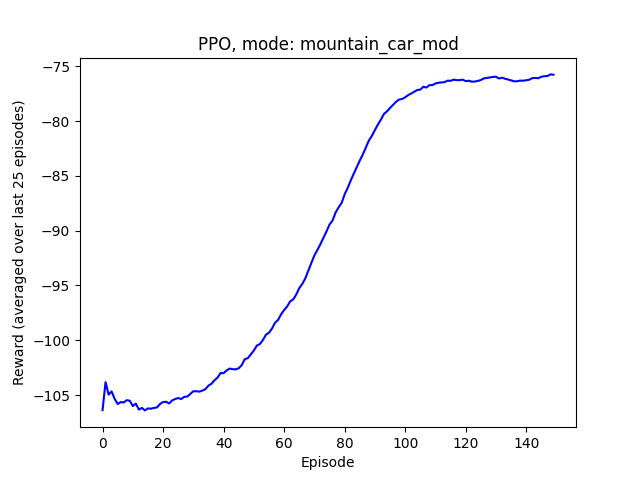  
(b) 
* 此環境的reward 將原有一致的 -1 reward 替換成了車子目前的高度
* 這種 reward 轉變讓 agent 即使沒有抵達過終點，也能夠依靠目前的車子高度學會要往高處開，合理的Reward 設計成功引導 agent 前往正確的學習方向，使三種方法在這種環境中都能學習到正確的策略，其中三種方法的學習特徵與先前實驗一致，皆為 PPO > Reinforce with Baseline > Reinforce
